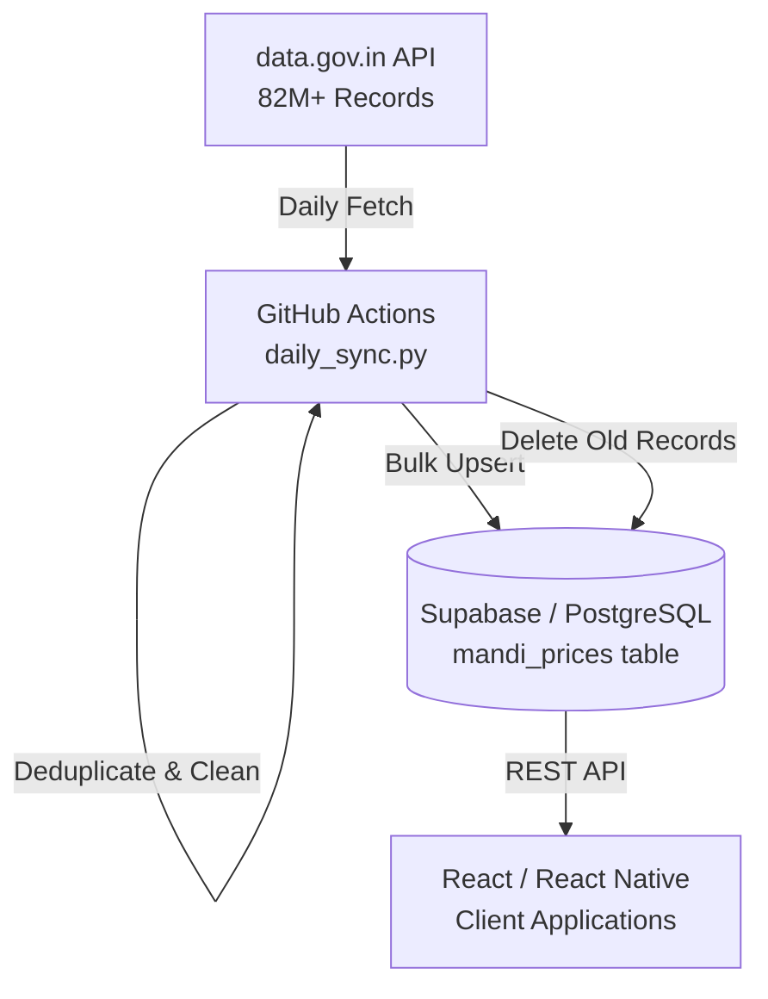

# FarmRisk Mandi Prices Backend

This repository contains the automated data pipeline for fetching daily APMC mandi prices from the Government of India's Open Data API (data.gov.in) and maintaining a 30-day rolling historical window in a Supabase PostgreSQL database.

This backend serves as the foundation for the FarmRisk Mandi React and React Native frontends, ensuring they can query millions of price records with millisecond latency without directly depending on government API uptime.

## System Architecture



## Core Components

### 1. Smart Sync Automation (`scripts/daily_sync.py`)
The primary engine of the data pipeline. When triggered, it performs the following tasks:
- **Gap Detection**: Queries Supabase for the most recent `arrival_date`. If the sync has missed any days (e.g., due to server downtime), it automatically calculates the missing days and fetches them sequentially up to yesterday's date.
- **Robust Fetching**: Implements pagination (10,000 records per page), timeout handling, and exponential backoff to handle intermittent government API failures.
- **Deduplication**: Cleans the dataset in-memory to prevent PostgreSQL unique constraint violations (Error 21000) caused by duplicate entries in the source API.
- **Rolling Window Management**: After a 100% successful sync, it executes a targeted deletion of any records strictly older than 30 days, keeping the database lightweight and cost-effective.

### 2. Database Schema (Supabase)
The data is stored in a single master table optimized for read-heavy operations across different geographic regions and commodities.

```sql
CREATE TABLE mandi_prices (
    id SERIAL PRIMARY KEY,
    state VARCHAR(100),
    district VARCHAR(100),
    market VARCHAR(100),
    commodity VARCHAR(100),
    variety VARCHAR(100),
    arrival_date DATE,
    min_price NUMERIC,
    max_price NUMERIC,
    modal_price NUMERIC,
    UNIQUE(state, district, market, commodity, variety, arrival_date)
);

CREATE INDEX idx_mandi_state_dist ON mandi_prices(state, district);
CREATE INDEX idx_mandi_commodity ON mandi_prices(commodity);
CREATE INDEX idx_mandi_date ON mandi_prices(arrival_date);
```

### 3. GitHub Actions Workflow (`.github/workflows/daily-sync.yml`)
The workflow is scheduled to run daily at 01:00 UTC (06:30 AM IST). By this time, the previous day's market data is guaranteed to be fully consolidated by the government servers. The workflow runs the sync script autonomously and requires no server maintenance.

## Setup & Deployment

1. **Database Setup**: Execute the SQL schema above in your Supabase SQL Editor.
2. **Repository Secrets**: To enable the automated sync, configure the following repository secrets in GitHub (`Settings > Secrets and variables > Actions`):
   - `GOV_API_KEY`: Your data.gov.in API key.
   - `SUPABASE_URL`: Your Supabase project URL.
   - `SUPABASE_KEY`: Your Supabase Service Role Key (Secret Key).

## Frontend Integration Note
Client applications should query the Supabase REST API using the Supabase anonymous publishable key. Because of the implemented compound indexes, querying prices filtered by `state`, `district`, or `commodity` will return results in milliseconds.
